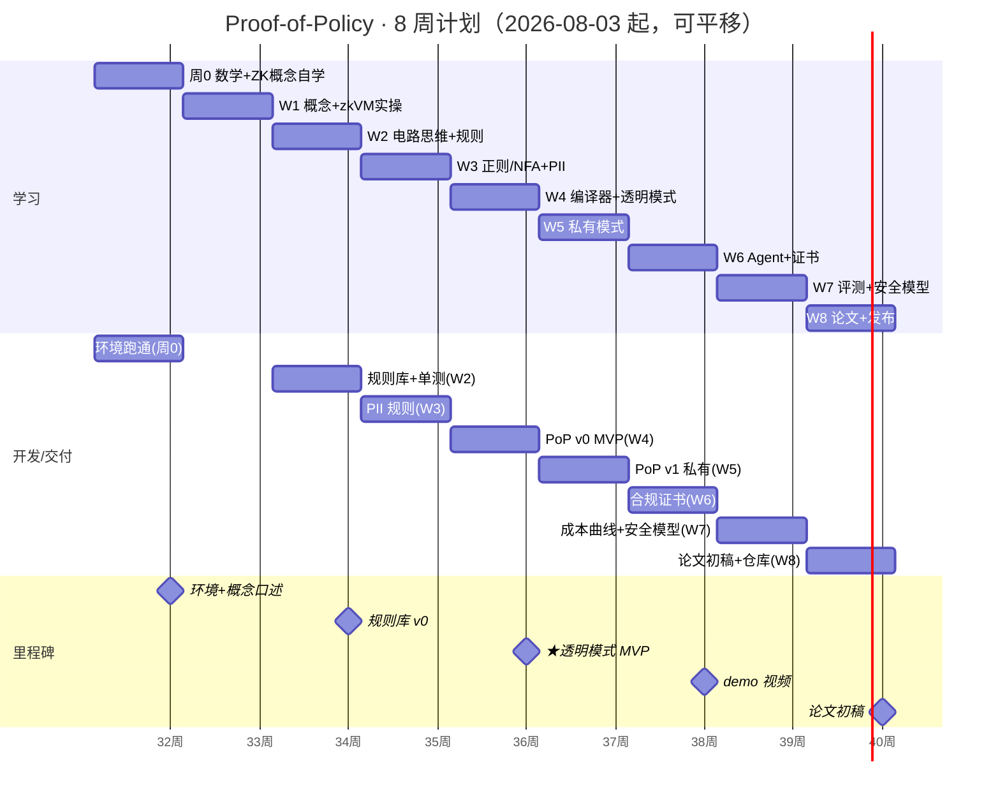

# Proof-of-Policy · 8 周甘特图 & 看板

> 起始日按 2026-08-03（周0）排布，可整体平移。依赖关系见 v2 计划：周0→W1→W2→W3→W4(★MVP)→W5→W6→W7→W8。
> 配套：《方向2_Proof-of-Policy_8周计划_v2_零基础版.md》、`docs/learning-calendar.md`。

## 一、甘特图（Mermaid）



## 二、关键路径

```
周0 ─► W1 ─► W2 ─► W3 ─► W4(★MVP) ─► W6 ─► W7 ─► W8
                                └─► W5(私有,可并行/压缩)
```

- **关键路径**：环境 → 规则库 → PII 正则 → 透明模式 MVP → agent 证书 → 评测 → 论文。
- **滞后砍单顺序**：W5 私有模式 → W6 agent 深度集成 → W7 消融（保透明模式 + 基础评测）。

## 三、看板（Swimlane：周 / 待办 / 进行中 / 已完成）

> 勾选即更新；每周末做一次「口述验收」（见 learning-calendar 附：每周一句话检查点）。

| 周 | 待办（本周） | 进行中 | ✅ 已完成 |
|---|---|---|---|
| **周0** | [ ] 装 Rust+SP1；[ ] 跑通 fibonacci 证明 | | [ ] 概念阅读开始 |
| **W1** | [ ] 概念笔记（三性质/R1CS）；[ ] SP1 最小证明 | | [ ] 环境跑通 |
| **W2** | [ ] KeywordBlock/LengthBound 实现+单测；[ ] 基准表 | | [ ] 规则库 v0 |
| **W3** | [ ] PatternBlock（NFA 路径）；[ ] ≥2 类 PII 规则 | | [ ] 字符串规则模块 |
| **W4** | [ ] 策略编译器；[ ] 透明模式端到端；[ ] 链上 verify | | [ ] **PoP v0（MVP）** |
| **W5** | [ ] 响应承诺；[ ] 违规定位披露；（尽力）redaction | | [ ] PoP v1 私有简化 |
| **W6** | [ ] LangGraph 插桩；[ ] 合规证书；[ ] 链上锚定 | | [ ] 证书 + demo |
| **W7** | [ ] 成本曲线；[ ] 四象限表；[ ] 安全模型草稿 | | [ ] 评测 + 模型 |
| **W8** | [ ] 论文初稿；[ ] 复现指南；[ ] demo 视频 | | [ ] 论文 + 仓库 |

## 四、周产出速查（对仓库落点）

| 周 | 落点 | 验收 |
|---|---|---|
| W1 | `docs/w1_notes.md`、SP1 例程 | 口述三性质 |
| W2 | `policydsl/model.py`、`tests/test_dsl.py` | 单测全绿 + 基准表 |
| W3 | `policy_packs/finance_redaction_v1.json`、`docs/policy-dsl.md` | ≥2 类 PII 通过 |
| W4 | `circuits/program`、`circuits/script` | PoP v0 证明→验证 |
| W5 | 私有模式模块、`docs/security-model.md` 第一节 | 验证者看不到全文 |
| W6 | `demo/`、cert 脚本 | 真实会话证书可验证 |
| W7 | `bench/`、`docs/security-model.md` | 成本曲线 + 对比表 |
| W8 | 论文 + README 复现 | 导师按 README 复现通过 |

## 五、风险与退路（速览）

| 风险 | 退路 |
|---|---|
| 正则电路成本超预算 | 砍 PII 至 2 类；保关键词+长度即达 W4 |
| 私有模式拖慢 | 降级为「承诺+违规定位」 |
| SP1 工具链安装受阻 | 周0 集中装；Python 参考层先行开发 |
| WITNESS 概念冲突 | 以「通用 DSL+开源+双隐私+形式化模型」定位 |
